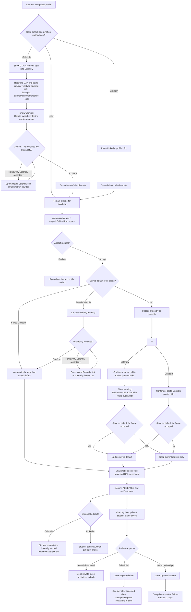

# Calendly And Coordination

Last updated: 2026-09-24

**Primary readers:** Backend, Frontend, Product Designer
**Priority:** Highest  
**Read this when:** You are implementing alumni coordination preferences, accepted-request handoff, Calendly embed, LinkedIn handoff, or self-reported conversation follow-up.

## Purpose

This feature governs how an accepted Coffee Run gives the student one clear, alumnus-selected way to coordinate off-platform. It deliberately avoids building calendar integration, in-platform messaging, or native time coordination in MVP 1.

## Product Decision And Rationale

MVP 1 prioritizes high-quality accepted matches over verified booking or verified meeting completion. Requiring alumni to connect a calendar before they can be matched adds onboarding friction, even though many alumni do not know their immediate availability and may use OAA infrequently. Expiring an accepted request after 24 hours also risks losing a high-quality connection because students may not schedule immediately.

Therefore:

- `acceptingRequests = true` is the hard matching eligibility control; Calendly or LinkedIn setup is not a matching filter
- an alumnus may defer contact-preference setup during onboarding
- an alumnus must select one valid coordination route before an acceptance is finalized and exposed to the student
- accepted requests remain available; OAA uses limited nudges and self-reported signals rather than scheduling punishment

## MVP Coordination Routes

Each accepted request snapshots exactly one route:

1. `CALENDLY`
   - the alumnus supplies a valid public Calendly event-type URL
   - the student sees `Choose a time with [Alumnus]`
   - the CTA opens an inline Calendly embed in OAA, with `Open Calendly in a new tab` fallback
2. `LINKEDIN`
   - the alumnus supplies or confirms a valid LinkedIn profile URL
   - the student sees `Connect with [Alumnus] on LinkedIn`
   - the CTA opens the alumnus's LinkedIn profile in a new tab

Do not show both routes for the same accepted request. Personal email is never shown to the student in MVP 1.

## Alumni Experience

### Onboarding and profile

- after basic profile setup, show an optional `How should students coordinate after you accept?` section
- show two cards: `Calendly` for direct booking and `LinkedIn` for off-platform coordination
- for Calendly, show `Create or sign in to Calendly` as an external CTA, then ask the alumnus to return and paste their public event-type booking URL, for example `https://calendly.com/name/coffee-chat`; do not accept a Calendly dashboard, account-settings, or profile-only URL
- when the alumnus saves a Calendly URL as their default, show this warning before saving: `Make sure you indicate or update your availability for the whole semester. Students will use this link to book directly with you.`
- the alumnus may select `I'll do this later` during onboarding and remain eligible for matching
- alumni can add or edit a saved Calendly event link or LinkedIn profile URL from Profile or Settings

### Acceptance

- an alumnus reviews and chooses to accept because the ask is clear and within scope
- before the action is committed as `ACCEPTED`, require one valid coordination route for that request
- if a saved LinkedIn default route exists, automatically apply and snapshot it when the alumnus accepts; do not show another route-selection or confirmation step
- if a saved Calendly default route exists, do not ask the alumnus to re-enter the URL or reselect a route. Before snapshotting it, show the Calendly availability warning with `Review my Calendly availability` and `Confirm. I've reviewed my availability`; the review CTA opens the saved link or Calendly in a new tab
- if no saved default exists, require one valid route before final acceptance and offer `Save this as my default for future accepted requests`
- an alumnus changes a saved default only from Profile or Settings before accepting a future request; changing it does not alter any route already snapshotted on an accepted request
- for a Calendly route, show this warning before final confirmation: `Make sure you indicate or update your availability for the whole semester. Students will use this link to book directly with you.` OAA validates the public URL format only; it does not verify that open times exist
- do not expose the acceptance to the student until the route is selected and snapshotted

## Student Experience

- acceptance notification states that the Coffee Run was accepted and immediately shows `Here's how to connect with [Alumnus]`
- for `CALENDLY`, render the booking CTA and inline embed only after student action; do not prefill the student's name or email into Calendly in MVP 1
- for `LINKEDIN`, render only the LinkedIn CTA; do not create an OAA message thread or suggested-message feature in MVP 1
- if the stored Calendly link later fails, show a neutral error and ask the student to return later; never reveal personal email as a fallback

## Self-Reported Scheduling And Conversation Flow

OAA does not treat an embedded Calendly browser event as a verified booking or meeting record.

- one elapsed day after acceptance, send the student a private status check: `When did or will your conversation with [Alumnus] happen?`
- choices are `It already happened`, `It is scheduled`, or `Not scheduled yet`
- `It is scheduled` requires the student to provide the expected meeting date; do not require a time
- `Not scheduled yet` offers optional structured reasons: `Alumnus has not responded`, `Scheduling conflict`, `No longer meeting`, `Other`, or `Prefer not to say`
- after `Not scheduled yet`, send one private student follow-up after three days; do not send more scheduling reminders after that follow-up
- when a student supplies an expected date, send private conversation pulse invitations to both student and alumnus one day after that date
- pulse recipients must not see the other participant's expected date, scheduling answer, reason, or feedback
- if the student says the conversation already happened, send both private pulse invitations immediately
- missing responses remain `UNKNOWN`, never an assumed failed or completed conversation

## Notification Limits

- after acceptance and route display, send the student one gentle scheduling reminder after 48 elapsed hours if no self-reported schedule or conversation exists
- the three-day follow-up after a `Not scheduled yet` response is the final student scheduling follow-up
- do not send repeated scheduling reminders to the alumnus after acceptance
- accepted requests do not expire because no booking signal is received

## MVP Tracking

Record:

- optional saved default coordination route and URL on the alumnus profile
- coordination route selected and immutable request snapshot URL
- coordination CTA rendered and clicked
- student schedule status, expected date when supplied, and optional unscheduled reason
- private pulse invitation, completion, and self-reported conversation outcome

The following are not valid MVP claims or metrics:

- verified booking rate
- verified completion rate
- cancellation rate
- reschedule rate

## Cost And Data Boundary

- Calendly embed is available on Calendly's Free plan. OAA has no Calendly platform charge for an embed-only implementation.
- an alumnus who selects Calendly needs their own Calendly account and public event-type link. Calendly Free currently supports one event type, one calendar connection, and one-on-one scheduling.
- OAA does not use Calendly OAuth, API tokens, webhooks, calendar sync, or server-side booking tracking in MVP 1.
- OAA does not receive Calendly event data. The student enters booking details directly in Calendly.
- paid Calendly host plans, OAuth token storage, signed webhook processing, provider-event retention, and provider-data privacy disclosures are post-MVP work.
- the technical team must estimate implementation effort separately; MVP integration is limited to URL validation, route snapshotting, embed rendering, CTA telemetry, and self-reported follow-up jobs.

## Post-MVP: Verified Completion Rate

Verified completion is deferred until OAA implements OAuth and signed Calendly webhooks.

- a verified completion proxy requires a server-verified Calendly booking whose scheduled end passes without cancellation
- stronger evidence additionally requires at least one participant confirmation that the conversation occurred
- `Verified Completion Rate = verified completed conversations / accepted requests`
- this phase requires paid Calendly host plans, OAuth/token handling, webhook signature verification, idempotency, provider-data retention/deletion rules, and updated privacy disclosures

## Explicitly Out Of Scope For MVP 1

- Calendly OAuth connection, API, and webhooks
- native rescheduling, cancellation, calendar sync, or booking verification
- in-platform messaging and personal-email sharing
- automatic meeting completion and verified-completion reporting

## Flow Diagram

