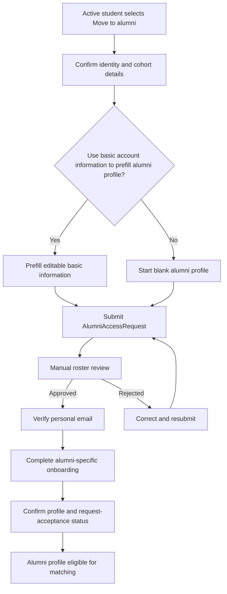
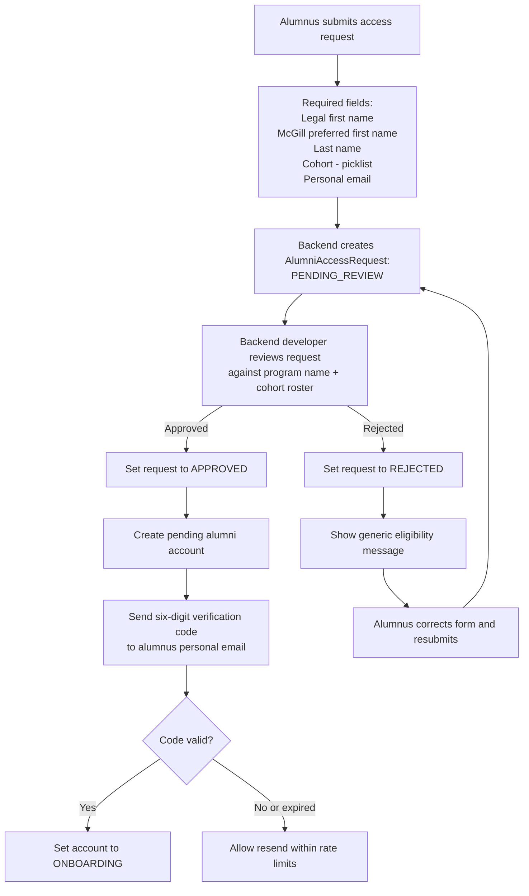

# Email Verification

Last updated: 2026-09-24

**Primary readers:** Backend, Frontend  
**Priority:** High  
**Read this when:** You are implementing signup, verification, eligibility, or account activation.

## Purpose

This feature governs eligible-account creation, email ownership verification, and role assignment before onboarding begins.

## Business Intent

Only eligible McGill community members should be able to access One Ask Away. Email ownership and program eligibility are separate checks and both must pass.

## Core Rules

- students must use eligible `@mail.mcgill.ca` addresses
- an alumnus submits an access-request form containing required legal first name, McGill preferred first name, last name, MMA cohort code, and personal email address
- cohort is a required canonical picklist supplied by the program, for example `MMA8` and `MMAO1`; it has no `Other` or free-text option
- every alumni access request requires manual eligibility review against the program-provided name-and-cohort roster; no alumni request is approved automatically
- the program roster must contain only the minimum eligibility data needed for review, such as name and cohort code; OAA must not request, import, or use alumni personal email addresses from the program roster
- after manual approval, the alumnus verifies ownership of the personal email they supplied; email verification does not by itself prove alumni eligibility
- authorized program staff may use eligible `@mcgill.ca` addresses
- role is assigned only after manual alumni eligibility approval; cohort is confirmed by the reviewer from the roster, not from self-selection alone
- for beta and MVP 1, a backend developer performs reviews through backend/database tooling; no end-user admin-review UI is required
- OAA Admin and Program Director role-based review permissions, including read-only program access, are post-beta decisions and must not block this workflow
- student accounts progress from `PENDING_VERIFICATION` to `ONBOARDING` to `ACTIVE`; an approved alumni access request creates an alumni account at `PENDING_VERIFICATION`, which then progresses to `ONBOARDING` and `ACTIVE`
- users cannot match, request, or schedule until the account is `ACTIVE`
- verification uses a six-digit numeric code
- code expiry is 10 minutes
- codes are single-use
- resending invalidates prior active codes
- one verification record allows up to five failed attempts
- one email may request up to three verification emails in a rolling 15-minute window

## Frontend Requirements

- provide role-appropriate email-entry flows with neutral eligibility messaging
- for alumni, collect required legal first name, McGill preferred first name, last name, cohort-code picklist selection, and personal email
- present the required consent acknowledgement; exact consent copy, notification purposes, consent versioning, and withdrawal handling will be finalized separately before launch
- show a pending-review state after alumni submission; do not reveal whether a name appears on the roster when a request is rejected or cannot be matched
- allow a rejected alumnus to correct the submitted details and resubmit for a new manual review
- provide a code-entry screen with resend behavior and clear countdown messaging
- show clear account-state progress: verification, onboarding, active
- block access to onboarding completion, matching, requests, and scheduling until verification succeeds
- if a verified account already exists, redirect the user to sign-in rather than new signup

## Backend Requirements

- normalize email before any lookup or rate limiting
- verify the student domain requirement and roster membership separately
- create an `AlumniAccessRequest` for each alumni submission, validate cohort against the program-supplied canonical picklist, and set it to `PENDING_REVIEW`
- for beta and MVP 1, enable the backend developer to approve or reject every access request through backend/database tooling after manually checking the name-and-cohort roster
- preserve each review attempt and its decision history when an alumnus corrects details and resubmits; do not overwrite the rejected request
- never automatically approve an alumnus from a name, cohort, email, or LinkedIn match
- do not send an alumni verification code or activate an alumni account until manual eligibility approval succeeds
- create or retrieve a pending alumni account only after approval; bind it to the personal email supplied in the approved request
- generate verification codes securely and store only code hashes
- store purpose, send time, expiry, invalidation, attempt count, and usage timestamps
- apply resend and attempt limits by normalized email, account, and IP context
- assign the `ALUMNI` role from the approved access request and reviewer-confirmed roster record at verification success
- transition account to `ONBOARDING` atomically with verification success
- reject expired, locked, or superseded codes

## Notifications

- send verification email with user name, six-digit code, expiry notice, and security disclaimer
- do not include passwords or sensitive profile data

## Data And Audit Requirements

- audit code generation, resend, invalidation, attempt increments, success, and failure
- audit alumni access-request submission, submitted cohort code, consent acknowledgement, reviewer identity, approval or rejection, roster-match reference, resubmission, and any subsequent email change
- retain only the minimum roster-match data necessary for eligibility audit and support; do not store program-supplied personal email addresses
- retain enough history to explain why a user could or could not verify

## Open Technical Questions (Must Decide)

- final consent copy, notification purposes, consent versioning, and withdrawal handling
- post-beta role-based permissions for OAA Admin and Program Director access
- retention period for rejected access requests and manual-review evidence
- after an active student becomes an alumnus, whether their student mode remains eligible for new matches and asks, or becomes history-only
- confirm the availability of the Switch to Alumni button

## Future: Student To Alumni Conversion (Post-MVP)

A student-to-alumni conversion must add an alumni capability to the existing person; it must never delete or overwrite the student's profile, requests, reflections, meetings, or matching history.

- a verified active student may choose `Move to alumni` after graduation eligibility is confirmed; rollover is not automatic based only on elapsed time
- the conversion starts a new `AlumniAccessRequest` linked to the existing `User`, then follows the same manual roster review and personal-email verification flow as any other alumni request
- the conversion form may offer an opt-in choice to use existing basic account information to prefill the alumni profile; all prefilled values must be editable before confirmation
- student-only onboarding data, including aspirations, current priorities, and target-role context, must not be treated as alumni offerings or reused as matching signals without the user's confirmation
- after approval and personal-email verification, the user completes alumni-specific onboarding: career background, current role/company/city, offerings, optional non-offerings, and request-acceptance status; a Calendly or LinkedIn coordination preference is optional until they finalize an acceptance
- no existing alumni onboarding requirement is skipped solely because the person was formerly a student; only verified basic identity data may be prefilled
- alumni-to-alumni discovery and an end-user role-switching interface remain post-MVP scope

## Process Flow

